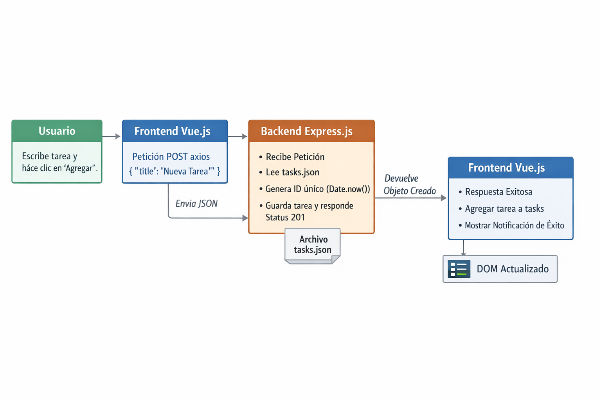
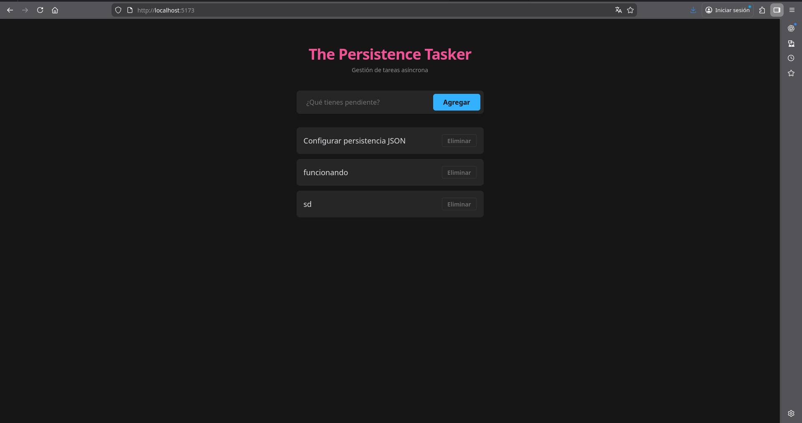
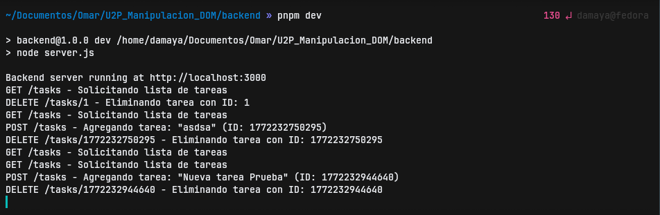

# The Persistence Tasker

Práctica 2: Sistema de Gestión de Tareas Asíncrono con Vue.js 3 y Express.

##  Requisitos
- [Node.js](https://nodejs.org/)
- [pnpm](https://pnpm.io/) (O recomendado para el frontend)

##  Cómo iniciar

### 1. Iniciar el Backend
Desde la raíz del proyecto, ejecuta:
```bash
cd backend
pnpm install
node server.js
```
El servidor de API estará disponible en: [http://localhost:3000/tasks](http://localhost:3000/tasks)

### 2. Iniciar el Frontend
En otra terminal desde la raíz, ejecuta:
```bash
cd frontend
pnpm install
pnpm dev
```
La aplicación estará disponible en: [http://localhost:5173](http://localhost:5173)

##  Estructura del Proyecto

- `backend/`: Servidor Express.js que gestiona las tareas con persistencia en `tasks.json`.
- `frontend/`: Aplicación Vue.js 3 (Vite + Tailwind CSS v4) con el tema **Oxocarbon**.
- `Entregables/`: Carpeta con los diagramas y capturas de pantalla de las pruebas.

##  Flujo de Datos (Para el Diagrama)

Diagrama de flujo:

1.  **Input del Usuario:** El usuario escribe el nombre de una tarea y hace clic en "Agregar".
2.  **Frontend (Petición POST):** Vue captura el evento y realiza una petición `axios` (POST) hacia el backend enviando el JSON `{ "title": "Nueva Tarea" }`.
3.  **Backend (Procesamiento):** 
    - Express recibe la petición.
    - Lee el archivo `tasks.json`.
    - Genera un ID único (`Date.now()`).
    - Agrega la tarea al arreglo y sobrescribe el archivo JSON.
    - Responde con el objeto creado (Status 201).
4.  **Frontend (Actualización del DOM):**
    - Vue recibe la respuesta exitosa.
    - Agrega la tarea al arreglo reactivo `tasks`.
    - Muestra una notificación (Toast) de éxito.
    - El DOM se updatea automáticamente mediante la reactividad de Vue.

### Evidencia del Diagrama


##  Pruebas
Puedes observar los **logs de la consola del servidor** para ver las peticiones en tiempo real (GET, POST, DELETE). La persistencia se mantiene en el archivo `backend/tasks.json` incluso si reinicias el servidor.

### Evidencia de Pruebas (Frontend)


### Evidencia de Pruebas (Backend)

